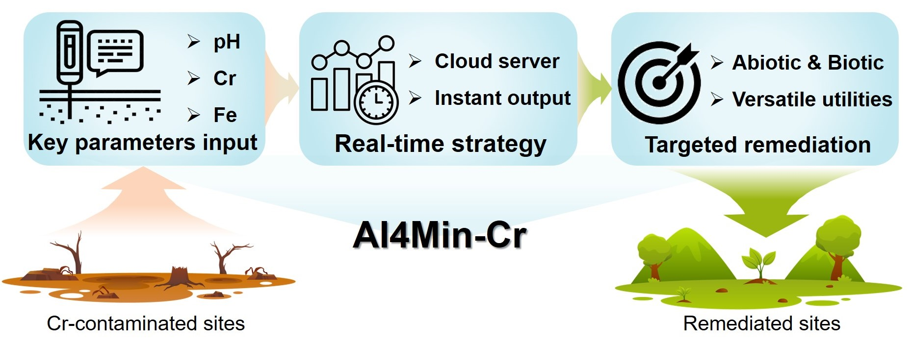

<p>
 <a href="https://doi.org/10.1038/s41467-025-57300-z">
     
 </a>
   <a href="https://doi.org/10.5281/zenodo.14744274">
     
 </a>
 
# Back to chromite as a mineralogical strategy for long-term chromium pollution control
Authors: Tianci Hua†, Yanzhang Li†, Yuxuan Hu†, Rongzhang Yin, Yanan Zhang, Bingxu Hou, Houze Lu, Xiang Ji, Xiangzhi Bai, Anhuai Lu, Yan Li*


This repo provides code and data to reproduce the results in the paper for ["Back to chromite as a mineralogical strategy for long-term chromium pollution control"](https://doi.org/10.1038/s41467-025-57300-z).

## 1. Introduction
<div align="center">
  
</div>

Re-oxidation of Cr(III) in treated Cr-contaminated sites poses a considerable source of Cr(VI) pollution, necessitating stable treatment solutions for long-term control. This study explores the immobilization of Cr(VI) into chromite, the most stable and weathering-resistant Cr-bearing mineral, under ambient conditions. Batch experiments demonstrate chromite formation at pH above 7 and Fe(III)/Cr(III) ratios exceeding 1, with Fe(III) occupying all tetrahedral sites, essential for stability. A theoretical model is developed to evaluate the effects of pH and Fe(III)/Cr(III) ratios on chromite crystallinity, resulting in AI4Min-Cr, a publicly accessible platform offering real-time intelligent remediation strategies. To tackle the complexities of non-point source Cr pollution, we employ microbial methods to regulate on-site Eh and pH, optimizing chromite precipitation. Long-term stability tests confirm that chromite remained stable for over 180 days, with potential for magnetic separation recovery. This study presents a mineralogical strategy to address re-oxidation and Cr resource recovery in Cr-contaminated water and soil.

## 2. Environment
We are good in the environment:
```
ubuntu 18.04 or Windows 10
openpyxl==3.0.11
pandas==2.0.3  
matplotlib==3.7.5  
numpy==1.24.4
```
## 3. Usage
You can directly visit our webpage [AI4Mineral](http://cr.ai4mineral.com/) for online use, or deploy it locally according to main.ipynb.

## 4. Data
All the raw data in the article is in Source data.xlsx, and the version used when running the code is the organized data.xls.


